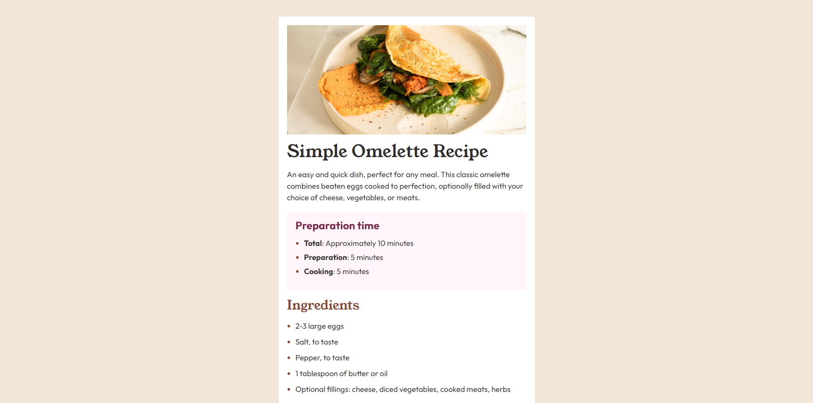
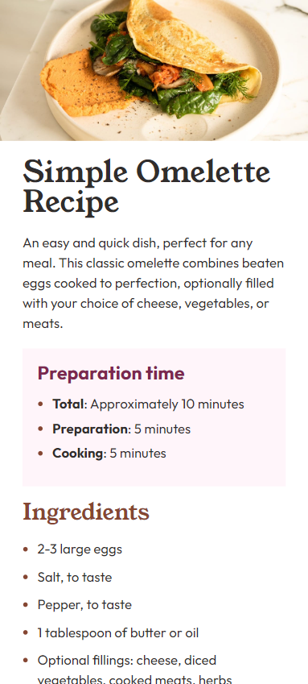

# Frontend Mentor - Recipe page solution

This is a solution to the [Recipe page challenge on Frontend Mentor](https://www.frontendmentor.io/challenges/recipe-page-KiTsR8QQKm). Frontend Mentor challenges help you improve your coding skills by building realistic projects.

## Table of contents

- [Overview](#overview)
  - [The challenge](#the-challenge)
  - [Screenshot](#screenshot)
  - [Links](#links)
- [My process](#my-process)
  - [Built with](#built-with)
  - [What I learned](#what-i-learned)
  - [Continued development](#continued-development)
- [Author](#author)

**Note: Delete this note and update the table of contents based on what sections you keep.**

## Overview

### Screenshot

### Links

- Solution URL: [Github](https://github.com/blvkrvbbit/recipe-page)
- Live Site URL: [Livesite](https://blvkrvbbit-recipe-page.netlify.app/)

## My process

### Built with

- Semantic HTML5 markup
- SCSS custom properties
- Flexbox
- Mobile-first workflow
- [React](https://reactjs.org/) - JS library

**Note: These are just examples. Delete this note and replace the list above with your own choices**

### What I learned

I learned how to better position content, and being responsive depending on the screen sizes.

### Continued development

Getting better at paying attention to detail, and find a better way to figure out the colors used in the project while not pro on front end mentor, so it's closer to the design files.

## Author

- Website - [Add your name here](https://www.your-site.com)
- Frontend Mentor - [@blvkrvbbit](https://www.frontendmentor.io/profile/blvkrvbbit)
- Twitter - [@blvkrvbbit](https://www.twitter.com/blvkrvbbit)
